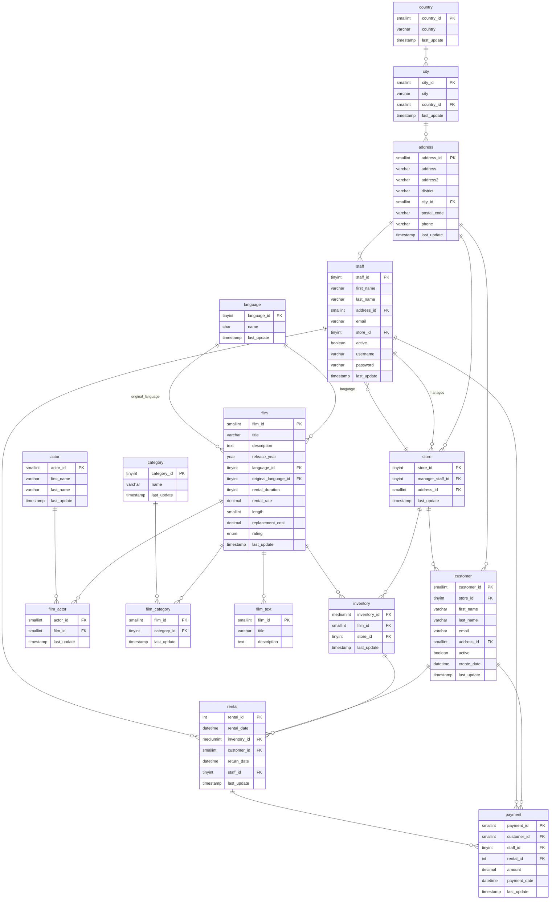

# Sakila App

## ER図

```mermaid
erDiagram
  actor {
    smallint actor_id PK
    varchar first_name
    varchar last_name
    timestamp last_update
  }
  address {
    smallint address_id PK
    varchar address
    varchar address2
    varchar district
    smallint city_id FK
    varchar postal_code
    varchar phone
    timestamp last_update
  }
  category {
    tinyint category_id PK
    varchar name
    timestamp last_update
  }
  city {
    smallint city_id PK
    varchar city
    smallint country_id FK
    timestamp last_update
  }
  country {
    smallint country_id PK
    varchar country
    timestamp last_update
  }
  customer {
    smallint customer_id PK
    tinyint store_id FK
    varchar first_name
    varchar last_name
    varchar email
    smallint address_id FK
    boolean active
    datetime create_date
    timestamp last_update
  }
  film {
    smallint film_id PK
    varchar title
    text description
    year release_year
    tinyint language_id FK
    tinyint original_language_id FK
    tinyint rental_duration
    decimal rental_rate
    smallint length
    decimal replacement_cost
    enum rating
    timestamp last_update
  }
  film_actor {
    smallint actor_id FK
    smallint film_id FK
    timestamp last_update
  }
  film_category {
    smallint film_id FK
    tinyint category_id FK
    timestamp last_update
  }
  film_text {
    smallint film_id PK
    varchar title
    text description
  }
  inventory {
    mediumint inventory_id PK
    smallint film_id FK
    tinyint store_id FK
    timestamp last_update
  }
  language {
    tinyint language_id PK
    char name
    timestamp last_update
  }
  payment {
    smallint payment_id PK
    smallint customer_id FK
    tinyint staff_id FK
    int rental_id FK
    decimal amount
    datetime payment_date
    timestamp last_update
  }
  rental {
    int rental_id PK
    datetime rental_date
    mediumint inventory_id FK
    smallint customer_id FK
    datetime return_date
    tinyint staff_id FK
    timestamp last_update
  }
  staff {
    tinyint staff_id PK
    varchar first_name
    varchar last_name
    smallint address_id FK
    varchar email
    tinyint store_id FK
    boolean active
    varchar username
    varchar password
    timestamp last_update
  }
  store {
    tinyint store_id PK
    tinyint manager_staff_id FK
    smallint address_id FK
    timestamp last_update
  }

  country ||--o{ city : ""
  city ||--o{ address : ""
  address ||--o{ customer : ""
  address ||--o{ staff : ""
  address ||--o{ store : ""
  store ||--o{ customer : ""
  store ||--o{ inventory : ""
  store ||--o{ staff : ""
  staff ||--o{ store : "manages"
  language ||--o{ film : "language"
  language ||--o{ film : "original_language"
  film ||--o{ film_actor : ""
  film ||--o{ film_category : ""
  film ||--o{ film_text : ""
  film ||--o{ inventory : ""
  actor ||--o{ film_actor : ""
  category ||--o{ film_category : ""
  inventory ||--o{ rental : ""
  customer ||--o{ rental : ""
  staff ||--o{ rental : ""
  customer ||--o{ payment : ""
  staff ||--o{ payment : ""
  rental ||--o{ payment : ""
```
