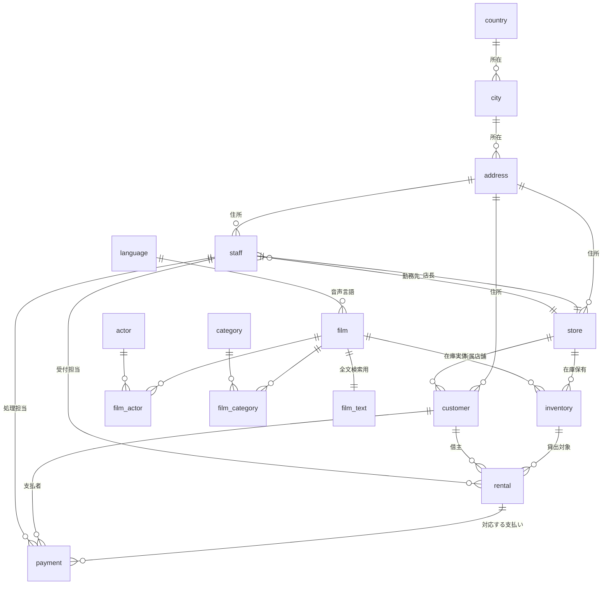
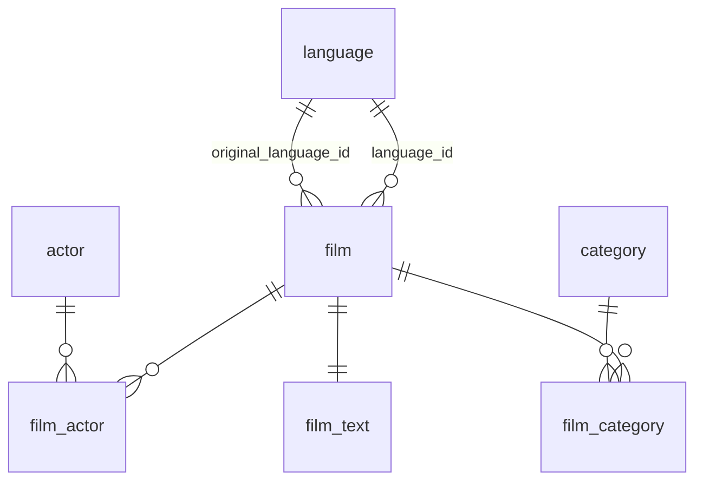
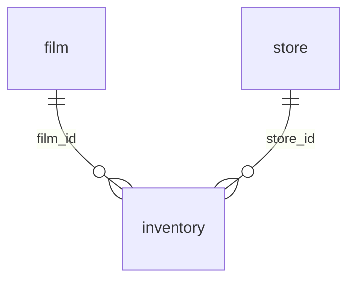
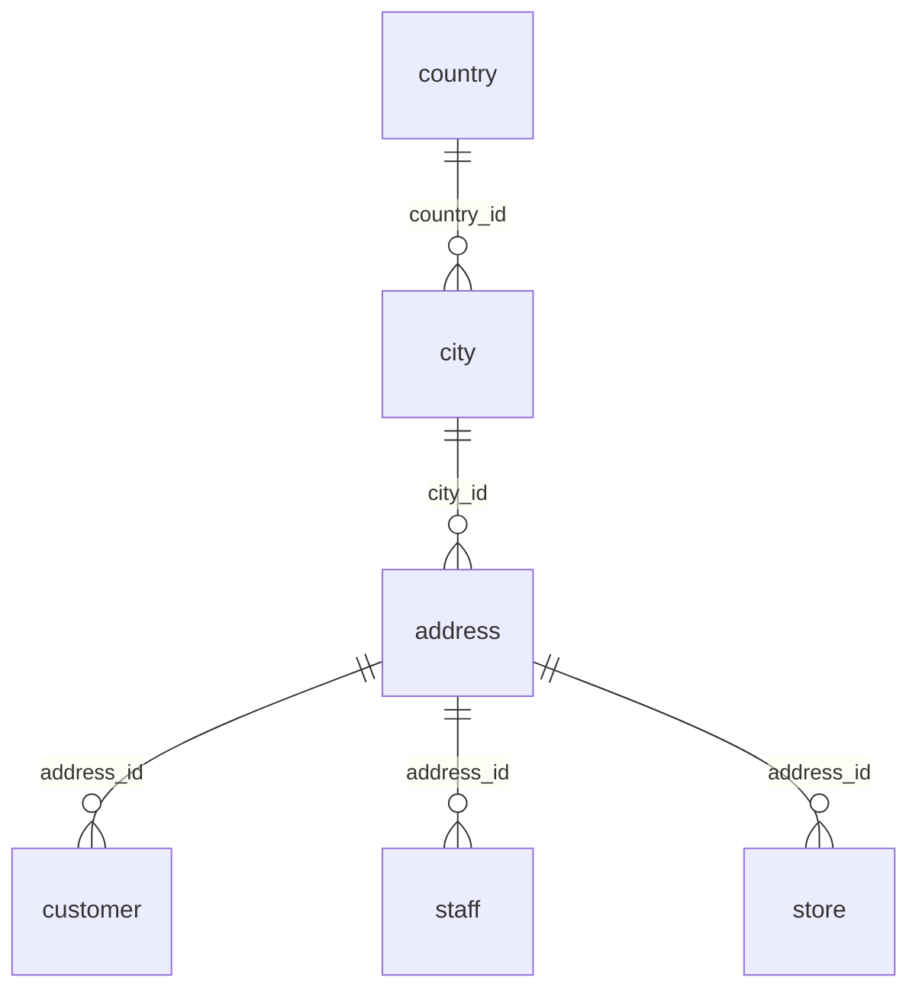
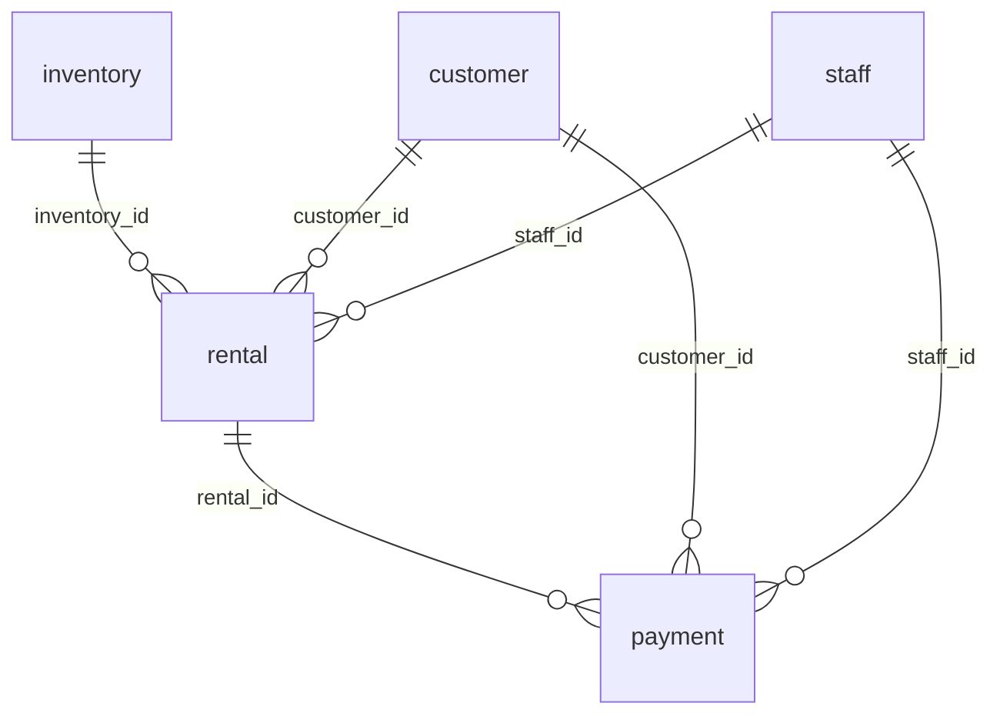

# 02. ER図・テーブル定義

出典は `db/init/01-sakila-schema.sql`（Sakila Sample Database 1.5）。
本ドキュメントはそのスキーマを読み解き、アプリ実装の視点で整理したもの。

## 全体ER図



## 4つのまとまりで捉える

16テーブルを一度に把握するのは難しいので、役割ごとに4群に分けて理解する。

### A. 作品カタログ群（7テーブル）

`film` を中心に、俳優・カテゴリ・言語が紐づく。**参照がほとんどで更新は少ない**。



- `film` ↔ `actor` は `film_actor` を介した**多対多**
- `film` ↔ `category` は `film_category` を介した**多対多**
- `film.language_id` と `film.original_language_id` は**同じ `language` テーブルを2回参照**する
  （吹き替え版の元言語を保持するため）。JOIN 時にエイリアスが必須になる

### B. 在庫・店舗群（2テーブル）



**`film` と `inventory` の区別が最重要**。

| | 意味 | 例 |
|---|---|---|
| `film` | 作品そのもの（カタログ上の1件） | 「ACADEMY DINOSAUR」という作品 |
| `inventory` | 物理的なDVD1枚 | 店舗1が持つその作品の3枚目 |

「作品が借りられるか」を判定するには `film` ではなく `inventory` を見る必要がある。
1,000作品に対し `inventory` は 4,581件、つまり1作品あたり平均4〜5枚の在庫がある。

### C. 顧客・住所群（4テーブル）



住所が `country` → `city` → `address` と3段に正規化されている。
顧客の国名を表示するだけで**3段JOIN**が必要になる。JOIN練習の題材として使える。

`address` は `customer`・`staff`・`store` の3者から参照される共有テーブル。

### D. 取引群（2テーブル）



アプリで**唯一まとまった更新が発生する**領域。

- `rental.return_date` が `NULL` = 貸出中（現在183件）
- `payment.rental_id` は `ON DELETE SET NULL`。つまりレンタル記録が消えても支払い記録は残る
- `rental` には `UNIQUE (rental_date, inventory_id, customer_id)` があり、
  同一DVDの同時刻・同一顧客への二重貸出を防いでいる

## テーブル定義

### film — 作品

| カラム | 型 | NULL | 既定値 | 備考 |
|---|---|---|---|---|
| `film_id` | SMALLINT UNSIGNED | × | AUTO_INCREMENT | PK |
| `title` | VARCHAR(128) | × | | INDEX あり |
| `description` | TEXT | ○ | NULL | |
| `release_year` | YEAR | ○ | NULL | |
| `language_id` | TINYINT UNSIGNED | × | | FK → `language` |
| `original_language_id` | TINYINT UNSIGNED | ○ | NULL | FK → `language` |
| `rental_duration` | TINYINT UNSIGNED | × | 3 | 貸出日数 |
| `rental_rate` | DECIMAL(4,2) | × | 4.99 | 貸出料金 |
| `length` | SMALLINT UNSIGNED | ○ | NULL | 上映時間（分） |
| `replacement_cost` | DECIMAL(5,2) | × | 19.99 | 紛失時弁償額 |
| `rating` | ENUM | ○ | 'G' | G / PG / PG-13 / R / NC-17 |
| `special_features` | SET | ○ | NULL | Trailers / Commentaries / Deleted Scenes / Behind the Scenes |
| `last_update` | TIMESTAMP | × | CURRENT_TIMESTAMP | ON UPDATE あり |

`rating` は ENUM、`special_features` は SET（複数値）。
Drizzle でこの2つをどう表現するかは後述の型対応表を参照。

### inventory — 在庫（DVD1枚）

| カラム | 型 | NULL | 備考 |
|---|---|---|---|
| `inventory_id` | MEDIUMINT UNSIGNED | × | PK |
| `film_id` | SMALLINT UNSIGNED | × | FK → `film` |
| `store_id` | TINYINT UNSIGNED | × | FK → `store` |
| `last_update` | TIMESTAMP | × | |

### rental — レンタル

| カラム | 型 | NULL | 備考 |
|---|---|---|---|
| `rental_id` | INT | × | PK |
| `rental_date` | DATETIME | × | 貸出日時 |
| `inventory_id` | MEDIUMINT UNSIGNED | × | FK → `inventory` |
| `customer_id` | SMALLINT UNSIGNED | × | FK → `customer` |
| `return_date` | DATETIME | ○ | **NULL = 貸出中** |
| `staff_id` | TINYINT UNSIGNED | × | FK → `staff`。受付担当 |
| `last_update` | TIMESTAMP | × | |

`UNIQUE (rental_date, inventory_id, customer_id)`

### payment — 支払い

| カラム | 型 | NULL | 備考 |
|---|---|---|---|
| `payment_id` | SMALLINT UNSIGNED | × | PK |
| `customer_id` | SMALLINT UNSIGNED | × | FK → `customer` |
| `staff_id` | TINYINT UNSIGNED | × | FK → `staff`。処理担当 |
| `rental_id` | INT | ○ | FK → `rental`（ON DELETE SET NULL） |
| `amount` | DECIMAL(5,2) | × | |
| `payment_date` | DATETIME | × | |
| `last_update` | TIMESTAMP | ○ | |

### customer — 顧客

| カラム | 型 | NULL | 備考 |
|---|---|---|---|
| `customer_id` | SMALLINT UNSIGNED | × | PK |
| `store_id` | TINYINT UNSIGNED | × | FK → `store` |
| `first_name` / `last_name` | VARCHAR(45) | × | `last_name` に INDEX |
| `email` | VARCHAR(50) | ○ | |
| `address_id` | SMALLINT UNSIGNED | × | FK → `address` |
| `active` | BOOLEAN | × | 既定 TRUE |
| `create_date` | DATETIME | × | |
| `last_update` | TIMESTAMP | ○ | |

### staff — スタッフ（ログインユーザー）

| カラム | 型 | NULL | 備考 |
|---|---|---|---|
| `staff_id` | TINYINT UNSIGNED | × | PK |
| `first_name` / `last_name` | VARCHAR(45) | × | |
| `address_id` | SMALLINT UNSIGNED | × | FK → `address` |
| `picture` | BLOB | ○ | PNG が入っている |
| `email` | VARCHAR(50) | ○ | |
| `store_id` | TINYINT UNSIGNED | × | FK → `store` |
| `active` | BOOLEAN | × | 既定 TRUE |
| `username` | VARCHAR(16) | × | |
| `password` | VARCHAR(40) | ○ | SHA1 想定の桁数 |

`password` が VARCHAR(40) なのは SHA1（16進40桁）を格納する前提だから。
bcrypt は60文字なので**カラム拡張が必要**。[05-auth.md](./05-auth.md) を参照。

### store — 店舗

| カラム | 型 | NULL | 備考 |
|---|---|---|---|
| `store_id` | TINYINT UNSIGNED | × | PK |
| `manager_staff_id` | TINYINT UNSIGNED | × | FK → `staff`、UNIQUE |
| `address_id` | SMALLINT UNSIGNED | × | FK → `address` |

`store` → `staff`（店長）と `staff` → `store`（勤務先）で**相互参照**になっている。
Drizzle でスキーマを書く際、循環参照をどう解決するかが論点になる（後述）。

### その他のテーブル

| テーブル | 主なカラム | 役割 |
|---|---|---|
| `actor` | `actor_id`, `first_name`, `last_name` | 俳優 |
| `category` | `category_id`, `name` | ジャンル（16種） |
| `language` | `language_id`, `name` (CHAR(20)) | 言語（6種） |
| `country` | `country_id`, `country` | 国 |
| `city` | `city_id`, `city`, `country_id` | 都市 |
| `address` | `address_id`, `address`, `district`, `city_id`, `postal_code`, `phone` | 住所 |
| `film_actor` | `actor_id` + `film_id`（複合PK） | 作品↔俳優 |
| `film_category` | `film_id` + `category_id`（複合PK） | 作品↔カテゴリ |
| `film_text` | `film_id`, `title`, `description` | 全文検索用（FULLTEXT INDEX） |

`address` には `location GEOMETRY` カラムがバージョン条件付きコメントで定義されている。
Drizzle では扱いが面倒なので、**スキーマ定義から除外してよい**（アプリで使わない）。

## Drizzle 型対応表

スキーマを手書きする際の変換指針。

| MySQL | Drizzle | 補足 |
|---|---|---|
| `SMALLINT UNSIGNED AUTO_INCREMENT` | `int().autoincrement()` または `smallint({ unsigned: true }).autoincrement()` | PK には `.primaryKey()` |
| `TINYINT UNSIGNED` | `tinyint({ unsigned: true })` | |
| `MEDIUMINT UNSIGNED` | `mediumint({ unsigned: true })` | |
| `VARCHAR(n)` | `varchar({ length: n })` | `length` 必須 |
| `CHAR(n)` | `char({ length: n })` | |
| `TEXT` | `text()` | |
| `DECIMAL(4,2)` | `decimal({ precision: 4, scale: 2 })` | 既定で **string** として返る |
| `YEAR` | `year()` | |
| `BOOLEAN` | `boolean()` | 実体は `TINYINT(1)` |
| `DATETIME` | `datetime({ mode: 'date' })` | `mode` で Date / string を選ぶ |
| `TIMESTAMP DEFAULT CURRENT_TIMESTAMP ON UPDATE CURRENT_TIMESTAMP` | `timestamp().defaultNow().onUpdateNow()` | |
| `ENUM('G','PG',...)` | `mysqlEnum(['G','PG',...])` | 配列で値を列挙 |
| `SET(...)` | Drizzle に SET 型はない | `varchar` で受けてアプリ側で `split(',')` |
| `BLOB` | `customType` が必要 | 使わないなら定義しない |

### つまずきやすい3点

**1. `DECIMAL` は文字列で返る**

`rental_rate` や `payment.amount` は `DECIMAL`。Drizzle の既定では `string` 型になる。
金額計算をする場合は数値変換するか、集計を SQL 側で完結させる。

```ts
// 合計は SQL 側で計算させるほうが安全
sum(payment.amount)
```

**2. `SET` 型が表現できない**

`film.special_features` は `SET('Trailers','Commentaries',...)`。
MySQL は内部的にカンマ区切り文字列として返すので、`varchar` として受けて分割する。

**3. `store` と `staff` の循環参照**

`store.manager_staff_id` → `staff`、`staff.store_id` → `store` で循環する。
TypeScript の型推論が循環で止まるため、片方の `references()` を遅延評価にする
（Drizzle は `references(() => ...)` のコールバック形式に対応している）。

## 手書きするテーブルの範囲

[01-overview.md](./01-overview.md) の方針どおり、学習効果の高い中核テーブルを手書きし、
補助テーブルは `drizzle-kit pull` で生成する案を基本とする。

| 区分 | テーブル | 方針 |
|---|---|---|
| 中核（手書き推奨） | `film`, `inventory`, `customer`, `rental`, `payment`, `staff`, `store` | ENUM・DECIMAL・循環参照・NULL許容など論点が集中している |
| 中間テーブル（手書き推奨） | `film_actor`, `film_category` | 複合PKの書き方を覚える価値がある |
| 補助（生成でよい） | `actor`, `category`, `language`, `country`, `city`, `address`, `film_text` | 単純な構造の繰り返し |

全部生成してから中核だけ書き直す、という順序でもよい。
生成結果を「答え合わせ」として使える点で、むしろ学習には向く。

## ビュー・ストアドプロシージャ

sakila には以下が定義済み。**アプリから使う必要はない**が、
同じ集計を Drizzle で書き直す際の「お手本」として参照価値がある。

| 種別 | 名前 | 内容 |
|---|---|---|
| VIEW | `customer_list` | 顧客 + 住所 + 都市 + 国の結合済み一覧 |
| VIEW | `film_list` | 作品 + カテゴリ + 俳優名の連結 |
| VIEW | `nicer_but_slower_film_list` | 上記の俳優名を整形したもの |
| VIEW | `staff_list` | スタッフ + 住所 |
| VIEW | `sales_by_store` | 店舗別売上 |
| VIEW | `sales_by_film_category` | カテゴリ別売上 |
| VIEW | `actor_info` | 俳優別の出演作をカテゴリごとに集約 |
| PROCEDURE | `rewards_report` | 優良顧客の抽出 |
| PROCEDURE | `film_in_stock` / `film_not_in_stock` | 在庫有無の判定 |
| FUNCTION | `get_customer_balance` | 顧客の未払い残高計算 |
| FUNCTION | `inventory_in_stock` | **特定DVDが貸出可能か判定** |
| FUNCTION | `inventory_held_by_customer` | そのDVDを今借りている顧客 |

### `inventory_in_stock` のロジックは押さえておく

レンタル機能の中核判定なので、この関数が何をしているか理解しておくと実装が早い。

```sql
-- 要約: その inventory_id に return_date IS NULL の rental が
--       1件でもあれば貸出中（=FALSE）、なければ在庫あり（=TRUE）
SELECT COUNT(rental_id)
FROM inventory LEFT JOIN rental USING(inventory_id)
WHERE inventory.inventory_id = ?
  AND rental.return_date IS NULL;
```

アプリでは同じ判定を Drizzle で書く。
「在庫があるか」は `inventory` の存在ではなく **`rental` の未返却レコードの不在**で決まる、
という点がこのスキーマの肝になる。
