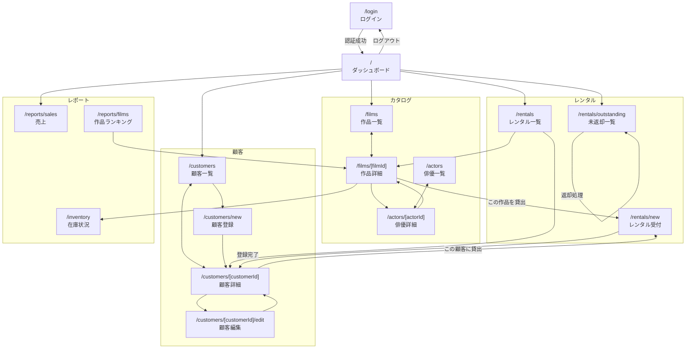
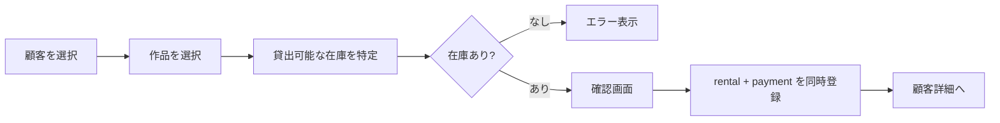

# 03. 画面設計

## ルーティング一覧

App Router の Route Group を使い、認証前後を `(auth)` と `(dashboard)` で分ける。
`(dashboard)/layout.tsx` でセッションを検証すれば、配下の全画面が一括で保護される。

| パス | 画面名 | 認証 | 主な使用テーブル |
|---|---|---|---|
| `/login` | ログイン | 不要 | `staff` |
| `/` | ダッシュボード | 必要 | `rental`, `payment`, `inventory` |
| `/films` | 作品一覧 | 必要 | `film`, `category`, `language` |
| `/films/[filmId]` | 作品詳細 | 必要 | `film`, `actor`, `category`, `inventory` |
| `/actors` | 俳優一覧 | 必要 | `actor`, `film_actor` |
| `/actors/[actorId]` | 俳優詳細 | 必要 | `actor`, `film` |
| `/customers` | 顧客一覧 | 必要 | `customer`, `address`, `city`, `country` |
| `/customers/[customerId]` | 顧客詳細 | 必要 | `customer`, `rental`, `payment` |
| `/customers/new` | 顧客登録 | 必要 | `customer`, `address` |
| `/customers/[customerId]/edit` | 顧客編集 | 必要 | `customer`, `address` |
| `/rentals` | レンタル一覧 | 必要 | `rental`, `customer`, `film` |
| `/rentals/new` | レンタル受付 | 必要 | `rental`, `payment`, `inventory` |
| `/rentals/outstanding` | 未返却一覧 | 必要 | `rental`, `customer`, `film` |
| `/inventory` | 在庫状況 | 必要 | `inventory`, `film`, `store`, `rental` |
| `/reports/sales` | 売上レポート | 必要 | `payment`, `store`, `staff` |
| `/reports/films` | 作品ランキング | 必要 | `rental`, `film`, `category` |
| `/reports/customers` | 顧客ランキング | 必要 | `payment`, `customer` |

合計17画面。すべてを一度に作る必要はなく、
[01-overview.md](./01-overview.md) の段階表に沿って積み上げる。

## 画面遷移図



## 画面ごとの構成

### `/login` — ログイン

認証前の唯一の画面。

| 要素 | 内容 |
|---|---|
| 入力 | `username`（必須）、`password`（必須） |
| 送信 | Auth.js の `signIn('credentials', ...)` |
| エラー | 「ユーザー名またはパスワードが正しくありません」（どちらが誤りかは明かさない） |
| 成功時 | `/` へリダイレクト |

`staff.active = false` のスタッフはログインを拒否する。

### `/` — ダッシュボード

ログイン直後の着地点。数字を並べて各画面への入口にする。

| カード | 表示内容 | 遷移先 |
|---|---|---|
| 未返却 | 貸出中の件数（現在183件） | `/rentals/outstanding` |
| 延滞 | 貸出期間を超過している件数 | `/rentals/outstanding?filter=overdue` |
| 在庫総数 | `inventory` 件数と貸出中の割合 | `/inventory` |
| 本日の受付 | ログイン中スタッフの当日処理件数 | `/rentals` |
| 売上推移 | 月次売上の折れ線グラフ | `/reports/sales` |

**注意:** データが2005〜2006年のため「本日の受付」は常に0件になる。
基準日の扱いは [04-features.md](./04-features.md) のダッシュボード節を参照。

### `/films` — 作品一覧

1,000件あるためページネーション必須。

| 要素 | 内容 |
|---|---|
| 検索 | タイトル・説明文（`film_text` の FULLTEXT を使う） |
| フィルタ | カテゴリ、レーティング、言語 |
| ソート | タイトル、公開年、貸出料金、上映時間 |
| 表示列 | タイトル / カテゴリ / レーティング / 上映時間 / 貸出料金 / 在庫数 |
| ページング | URLクエリ（`?page=2&category=Action`）で状態を保持 |

検索・フィルタの状態を URL に持たせると、Server Component のまま実装でき、
ブラウザバックや共有も自然に動く。

### `/films/[filmId]` — 作品詳細

| セクション | 内容 |
|---|---|
| 基本情報 | タイトル、説明、公開年、上映時間、レーティング、言語 |
| 料金 | 貸出料金、貸出日数、弁償額 |
| 特典 | `special_features`（カンマ区切りを分解してバッジ表示） |
| 出演者 | 俳優名の一覧（各名前から俳優詳細へ） |
| カテゴリ | ジャンルのバッジ |
| 在庫 | 店舗別の「総数 / 貸出可能数」 |
| 操作 | 「この作品を貸し出す」→ `/rentals/new?filmId=...` |

### `/customers` — 顧客一覧

| 要素 | 内容 |
|---|---|
| 検索 | 氏名、メールアドレス |
| フィルタ | 店舗、有効/無効（`active`） |
| 表示列 | 氏名 / メール / 都市 / 国 / 店舗 / 状態 |
| 操作 | 「新規登録」ボタン |

都市・国の表示に `address` → `city` → `country` の3段JOINが必要。

### `/customers/[customerId]` — 顧客詳細

| セクション | 内容 |
|---|---|
| 基本情報 | 氏名、メール、住所（3段JOINで整形）、所属店舗、登録日 |
| 貸出中 | この顧客が現在借りているDVD一覧 |
| 履歴 | 過去のレンタル履歴（ページング） |
| 支払い | 支払い履歴と累計額 |
| 未払い | `get_customer_balance` 相当の残高 |
| 操作 | 「編集」「この顧客に貸し出す」 |

### `/rentals/new` — レンタル受付

このアプリで最も複雑な画面。**トランザクションが必要**。



- クエリパラメータ（`?customerId=` / `?filmId=`）で前画面からの引き継ぎに対応する
- 在庫の確定から登録までの間に他スタッフが同じDVDを貸し出す可能性があるため、
  **登録時に再度在庫を確認する**（詳細は [06-data-access.md](./06-data-access.md)）

### `/rentals/outstanding` — 未返却一覧

| 要素 | 内容 |
|---|---|
| 表示列 | 顧客名 / 作品 / 貸出日 / 返却期限 / 経過日数 / 状態 |
| フィルタ | 延滞のみ、店舗別 |
| 操作 | 各行に「返却処理」ボタン |

返却期限は `rental.rental_date + film.rental_duration` で算出する。
`rental` から `inventory` を経て `film` に到達する必要がある点に注意。

### `/inventory` — 在庫状況

| 要素 | 内容 |
|---|---|
| 表示単位 | 作品 × 店舗 |
| 表示列 | 作品 / 店舗 / 総数 / 貸出中 / 貸出可能 |
| フィルタ | 店舗、在庫切れのみ |

集計の考え方は「`inventory` の件数」から「未返却 `rental` の件数」を引く。

### `/reports/sales` — 売上レポート

| 要素 | 内容 |
|---|---|
| 期間選択 | 開始日・終了日（既定値はデータ範囲の2005-05〜2006-02） |
| 集計軸 | 月別 / 店舗別 / スタッフ別 |
| 表示 | グラフ + 明細テーブル |

## URL 設計の方針

検索条件やページ番号は **URL のクエリパラメータに置く**。

```
/films?q=dinosaur&category=Action&rating=PG&sort=title&page=2
```

理由は3つ。

1. Server Component のまま実装できる（`searchParams` を受け取るだけ）
2. ブラウザバック・リロード・URL共有が自然に動く
3. クライアント側の状態管理が不要になり、React Hook Form は入力フォームだけに使える

一覧画面のフィルタを `useState` で持つと Client Component 化が連鎖するため、
最初から URL に寄せておくほうが構成が崩れにくい。

## レイアウト

```
┌────────────────────────────────────────────┐
│ ヘッダー: ロゴ / 検索 / ログイン中スタッフ名   │
├──────────┬─────────────────────────────────┤
│          │                                 │
│ サイド    │  各画面のコンテンツ               │
│ ナビ      │                                 │
│          │                                 │
│ ・ホーム   │                                 │
│ ・作品     │                                 │
│ ・俳優     │                                 │
│ ・顧客     │                                 │
│ ・レンタル  │                                 │
│ ・在庫     │                                 │
│ ・レポート  │                                 │
└──────────┴─────────────────────────────────┘
```

ヘッダーとサイドナビは `(dashboard)/layout.tsx` に置き、全画面で共有する。
ログイン中のスタッフ名と所属店舗をヘッダーに常時表示しておくと、
「誰として操作しているか」が明確になり、`staff_id` の自動付与が理解しやすくなる。
