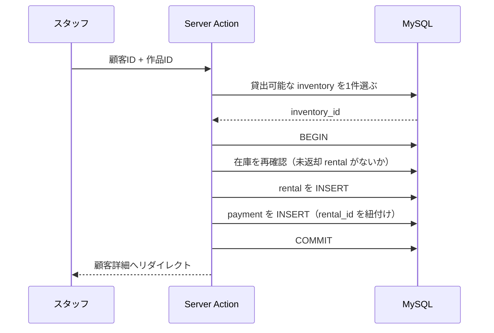

# 04. 機能一覧

各機能について「何をするか」「どのテーブルを使うか」「SQL上の要点」を整理する。
実装は手で行う前提のため、**完成コードではなくクエリの構造と注意点**を示す。

難易度は SQL の観点で3段階。

- ★ — 単一テーブル、または素直な JOIN
- ★★ — 複数段の JOIN、集約、サブクエリ
- ★★★ — トランザクション、競合制御、複雑な集計

## 機能マップ

| # | 機能 | 画面 | 難易度 | 種別 |
|---|---|---|---|---|
| F-01 | ログイン / ログアウト | `/login` | ★ | 更新 |
| F-02 | ダッシュボード集計 | `/` | ★★ | 参照 |
| F-03 | 作品一覧・検索・フィルタ | `/films` | ★★ | 参照 |
| F-04 | 作品詳細 | `/films/[filmId]` | ★★ | 参照 |
| F-05 | 俳優一覧・詳細 | `/actors` | ★★ | 参照 |
| F-06 | 顧客一覧・検索 | `/customers` | ★★ | 参照 |
| F-07 | 顧客詳細 | `/customers/[customerId]` | ★★ | 参照 |
| F-08 | 顧客登録・編集 | `/customers/new` | ★★ | 更新 |
| F-09 | レンタル受付 | `/rentals/new` | ★★★ | 更新 |
| F-10 | 返却処理 | `/rentals/outstanding` | ★★ | 更新 |
| F-11 | 未返却・延滞一覧 | `/rentals/outstanding` | ★★ | 参照 |
| F-12 | レンタル履歴一覧 | `/rentals` | ★★ | 参照 |
| F-13 | 在庫状況 | `/inventory` | ★★★ | 参照 |
| F-14 | 売上レポート | `/reports/sales` | ★★★ | 参照 |
| F-15 | 作品ランキング | `/reports/films` | ★★ | 参照 |
| F-16 | 顧客ランキング | `/reports/customers` | ★★ | 参照 |

---

## F-01. ログイン / ログアウト

**使用テーブル:** `staff`

| 項目 | 内容 |
|---|---|
| 入力 | `username`, `password` |
| 検証 | `staff.username` が一致し、`active = true` であること |
| セッション | `staff_id`, `store_id`, 氏名を保持 |

パスワード照合の方式は sakila の既存データが SHA1 のため特別な対応が要る。
[05-auth.md](./05-auth.md) を参照。

---

## F-02. ダッシュボード集計

**使用テーブル:** `rental`, `payment`, `inventory`, `film`

4つの数値を出す。それぞれ別クエリでよい。

| 指標 | 算出方法 |
|---|---|
| 未返却件数 | `rental` で `return_date IS NULL` を数える |
| 延滞件数 | 上記のうち `rental_date + film.rental_duration 日 < 基準日` のもの |
| 在庫総数 / 貸出中 | `inventory` の総数と、未返却 `rental` の件数 |
| 期間売上 | `payment` の `amount` を期間で絞って合計 |

延滞判定は `rental` → `inventory` → `film` と辿って `rental_duration` を得る必要がある。

```sql
-- 延滞件数の考え方
SELECT COUNT(*)
FROM rental r
JOIN inventory i ON r.inventory_id = i.inventory_id
JOIN film f      ON i.film_id = f.film_id
WHERE r.return_date IS NULL
  AND DATE_ADD(r.rental_date, INTERVAL f.rental_duration DAY) < :baseDate;
```

### 基準日の扱い（重要）

sakila のデータは **2005-05-24 〜 2006-02-14** で止まっている。
`NOW()` を使うと全レンタルが延滞扱いになり、当月売上は常に0になる。

対応の選択肢は3つ。

| 案 | 内容 | 評価 |
|---|---|---|
| A | 環境変数で「アプリ上の今日」を定義し、全集計でそれを使う | **推奨**。実装が一貫し、切り替えも容易 |
| B | データ範囲の最終日（`MAX(rental_date)`）を動的に基準日とする | データ依存だが自動追従する |
| C | 期間を必ずユーザーに選ばせ、既定値をデータ範囲にする | レポート画面には適するが、ダッシュボードには煩雑 |

案Aを基本とし、`APP_TODAY=2006-02-14` のような環境変数を用意する。
日付を扱う関数を1箇所（例: `lib/app-date.ts`）にまとめておくと、
後から実データに切り替える際の変更範囲が小さくて済む。

---

## F-03. 作品一覧・検索・フィルタ

**使用テーブル:** `film`, `film_text`, `film_category`, `category`, `language`, `inventory`

1,000件あるため、**件数取得と明細取得の2クエリ**になる。

| 条件 | 実装方針 |
|---|---|
| キーワード検索 | `film_text` の FULLTEXT インデックスを使う |
| カテゴリ絞り込み | `film_category` → `category` を JOIN |
| レーティング | `film.rating` の等値比較（ENUM） |
| 並び替え | `title` / `release_year` / `rental_rate` / `length` |
| ページング | `LIMIT` + `OFFSET` |

### FULLTEXT 検索の使いどころ

`film_text` は `title` と `description` に FULLTEXT インデックスを持つ。

```sql
SELECT film_id FROM film_text
WHERE MATCH(title, description) AGAINST (:keyword IN BOOLEAN MODE);
```

`LIKE '%keyword%'` でも動くが、1,000件規模でもインデックスが効かない。
FULLTEXT を使うほうが本来の設計意図に沿う。

Drizzle には `MATCH ... AGAINST` の専用 API がないため、`sql` テンプレートで書く。

### 在庫数の付与

一覧に「在庫数」を出す場合、`inventory` を JOIN して `GROUP BY film_id` で数える。
行数が増えるので、一覧の主クエリとは分けて、表示中の `film_id` に対してのみ
まとめて取得するほうが素直（N+1 を避けつつ主クエリを単純に保てる）。

---

## F-04. 作品詳細

**使用テーブル:** `film`, `language`, `film_actor`, `actor`, `film_category`, `category`, `inventory`, `rental`

1画面で4種類の情報を集める。それぞれ独立したクエリにしてよい。

| 情報 | クエリの要点 |
|---|---|
| 基本情報 | `film` + `language`。**`language` を2回 JOIN する**（`language_id` と `original_language_id`） |
| 出演者 | `film_actor` → `actor` |
| カテゴリ | `film_category` → `category` |
| 店舗別在庫 | `inventory` を `store_id` で集計し、未返却 `rental` を差し引く |

### 同一テーブルの二重 JOIN

`film.language_id`（音声言語）と `film.original_language_id`（原語）は
どちらも `language` を参照する。エイリアスを分けないと曖昧になる。

```sql
SELECT f.title, l.name AS language, ol.name AS original_language
FROM film f
JOIN language l       ON f.language_id = l.language_id
LEFT JOIN language ol ON f.original_language_id = ol.language_id
WHERE f.film_id = :filmId;
```

`original_language_id` は NULL 許容なので **LEFT JOIN** を使う。
自己結合ではないが同じ構造なので、書籍の自己結合の章と併せて理解すると定着しやすい。

### `special_features` の展開

`SET('Trailers','Commentaries','Deleted Scenes','Behind the Scenes')` 型。
MySQL からはカンマ区切りの文字列として返るので、アプリ側で分割してバッジ表示する。
空文字と NULL の両方がありうる点に注意。

---

## F-05. 俳優一覧・詳細

**使用テーブル:** `actor`, `film_actor`, `film`

| 画面 | 内容 |
|---|---|
| 一覧 | 俳優名 + 出演作品数（`film_actor` を `GROUP BY actor_id` で数える） |
| 詳細 | その俳優の出演作一覧（`film_actor` → `film`） |

`film_actor` は 5,462件。多対多の中間テーブルを扱う最も素直な題材。

---

## F-06. 顧客一覧・検索

**使用テーブル:** `customer`, `address`, `city`, `country`, `store`

住所表示のために**3段 JOIN** が必要。

```sql
SELECT c.customer_id, c.first_name, c.last_name, c.email,
       a.address, ci.city, co.country
FROM customer c
JOIN address a  ON c.address_id = a.address_id
JOIN city ci    ON a.city_id = ci.city_id
JOIN country co ON ci.country_id = co.country_id
WHERE c.active = TRUE
ORDER BY c.last_name
LIMIT :limit OFFSET :offset;
```

氏名検索は `first_name` / `last_name` の両方に対して行う。
`last_name` にはインデックスがあるが `first_name` にはない点も観察材料になる。

---

## F-07. 顧客詳細

**使用テーブル:** `customer`, `address`, `city`, `country`, `rental`, `inventory`, `film`, `payment`

| セクション | クエリの要点 |
|---|---|
| 基本情報 | F-06 と同じ3段 JOIN を単一行で |
| 貸出中 | `rental` の `return_date IS NULL` + `inventory` + `film` |
| 履歴 | 上記の全期間版。ページング必須 |
| 支払い履歴 | `payment` を日付降順 |
| 未払い残高 | 後述 |

### 未払い残高の算出

sakila の `get_customer_balance` 関数と同じ考え方を使う。

```
残高 = 貸出料金の累計 + 延滞料金 − 支払い済み合計
```

延滞料金は「返却期限を超えた日数 × 日割り料金」で計算される。
既存関数の中身を読んで、同じロジックを Drizzle で再現するのが学習として有効。

---

## F-08. 顧客登録・編集

**使用テーブル:** `customer`, `address`, `city`

新規登録は `address` と `customer` の**2テーブルへの挿入**になる。


途中で失敗すると住所だけが残るため、**トランザクションで囲む**。
`city_id` は既存の都市から選択させる（600件あるので検索可能なセレクトにする）。

`customer.create_date` は NOT NULL かつ既定値なしなので、
アプリ側で明示的に値を入れる必要がある。

---

## F-09. レンタル受付

**使用テーブル:** `rental`, `payment`, `inventory`, `film`, `customer`

このアプリで最も設計判断が多い機能。

### 処理の流れ



### 貸出可能な在庫の選び方

「その作品の在庫のうち、未返却レコードが存在しないもの」を1件取る。

```sql
SELECT i.inventory_id
FROM inventory i
LEFT JOIN rental r
       ON i.inventory_id = r.inventory_id
      AND r.return_date IS NULL
WHERE i.film_id = :filmId
  AND i.store_id = :storeId
  AND r.rental_id IS NULL
LIMIT 1;
```

`LEFT JOIN` + `IS NULL` で「該当なし」を絞り込む形。
書籍の外部結合の章がそのまま使える。

### 競合への対処

在庫を選んでから INSERT するまでの間に、別のスタッフが同じDVDを貸し出す可能性がある。
対処の選択肢は2つ。

| 案 | 内容 | 評価 |
|---|---|---|
| A | `SELECT ... FOR UPDATE` で在庫行をロックしてから INSERT | 確実。学習としても価値が高い |
| B | `rental` の `UNIQUE(rental_date, inventory_id, customer_id)` に任せる | 同一秒・同一顧客しか防げず不十分 |

**案Aを推奨**。スタッフ2名の学習用アプリでは実際には競合しないが、
トランザクション分離レベルとロックを体験する題材として意味がある。

### 支払い金額

`film.rental_rate` をそのまま `payment.amount` に入れる。
`payment.payment_date` と `rental.rental_date` は同一時刻にする
（sakila の既存データもその形になっている）。

`staff_id` は**セッションから自動付与**し、フォームからは受け取らない。
クライアントが送った値を信用すると、他スタッフになりすませてしまう。

---

## F-10. 返却処理

**使用テーブル:** `rental`, `film`, `inventory`

`rental.return_date` に現在時刻を入れるだけの単純な更新。

```sql
UPDATE rental
SET return_date = :now
WHERE rental_id = :rentalId
  AND return_date IS NULL;
```

`AND return_date IS NULL` を付けることで、
二重クリックや画面の再送信による上書きを防げる。更新件数が0なら「既に返却済み」と判定する。

延滞していた場合の追加料金を `payment` に登録するかどうかは設計判断。
最初は返却のみ実装し、余裕があれば延滞料金を足す、という順序でよい。

---

## F-11. 未返却・延滞一覧

**使用テーブル:** `rental`, `customer`, `inventory`, `film`

現在183件。返却期限と経過日数を算出して表示する。

```sql
SELECT r.rental_id, r.rental_date,
       c.first_name, c.last_name, f.title,
       DATE_ADD(r.rental_date, INTERVAL f.rental_duration DAY) AS due_date,
       DATEDIFF(:baseDate, DATE_ADD(r.rental_date, INTERVAL f.rental_duration DAY)) AS days_overdue
FROM rental r
JOIN customer c  ON r.customer_id = c.customer_id
JOIN inventory i ON r.inventory_id = i.inventory_id
JOIN film f      ON i.film_id = f.film_id
WHERE r.return_date IS NULL
ORDER BY due_date;
```

`rental` から `film` に到達するには `inventory` を経由する必要がある。
このスキーマの構造（作品と在庫の分離）を最も実感できるクエリ。

---

## F-12. レンタル履歴一覧

**使用テーブル:** `rental`, `customer`, `inventory`, `film`, `staff`

16,044件あるためページング必須。F-11 とほぼ同じ JOIN 構造で、
`return_date IS NULL` の条件を外し、期間・店舗・スタッフでフィルタできるようにする。

`OFFSET` が大きくなると遅くなることを体感できる規模。
カーソルベースのページングに切り替える練習にも使える。

---

## F-13. 在庫状況

**使用テーブル:** `inventory`, `film`, `store`, `rental`

作品 × 店舗ごとに「総数 / 貸出中 / 貸出可能」を出す。

```sql
SELECT f.film_id, f.title, i.store_id,
       COUNT(*) AS total,
       SUM(CASE WHEN r.rental_id IS NOT NULL THEN 1 ELSE 0 END) AS rented_out
FROM inventory i
JOIN film f ON i.film_id = f.film_id
LEFT JOIN rental r
       ON i.inventory_id = r.inventory_id
      AND r.return_date IS NULL
GROUP BY f.film_id, f.title, i.store_id;
```

`COUNT` と条件付き `SUM` を組み合わせる形。
`COUNT(r.rental_id)` でも同じ結果になる（NULL を数えないため）ので、
両方書いて挙動を比べると集約関数の理解が深まる。

---

## F-14. 売上レポート

**使用テーブル:** `payment`, `rental`, `inventory`, `store`, `staff`

| 集計軸 | 結合経路 |
|---|---|
| 月別 | `payment` のみ（`payment_date` を年月で丸める） |
| 店舗別 | `payment` → `rental` → `inventory` → `store` |
| スタッフ別 | `payment.staff_id` → `staff` |

### 店舗別売上の経路に注意

`payment` には `store_id` がない。店舗を特定するには
**`rental` → `inventory` → `store`** と3段辿る必要がある。
sakila の `sales_by_store` ビューが同じ経路を通っているので、読み比べるとよい。

### 月別集計

```sql
SELECT DATE_FORMAT(payment_date, '%Y-%m') AS month,
       SUM(amount) AS total,
       COUNT(*) AS count
FROM payment
WHERE payment_date BETWEEN :from AND :to
GROUP BY month
ORDER BY month;
```

期間の既定値は 2005-05-01 〜 2006-02-28 にしておく。
空のグラフを見せないための配慮で、F-02 の基準日の話と同じ理由。

---

## F-15. 作品ランキング

**使用テーブル:** `rental`, `inventory`, `film`, `film_category`, `category`

貸出回数の多い順に作品を並べる。

```sql
SELECT f.film_id, f.title, COUNT(*) AS rental_count
FROM rental r
JOIN inventory i ON r.inventory_id = i.inventory_id
JOIN film f      ON i.film_id = f.film_id
GROUP BY f.film_id, f.title
ORDER BY rental_count DESC
LIMIT 20;
```

カテゴリ別の集計に広げると `sales_by_film_category` ビューと同等になる。

---

## F-16. 顧客ランキング

**使用テーブル:** `payment`, `customer`

支払総額の多い順。`rewards_report` プロシージャが似た処理をしている。

```sql
SELECT c.customer_id, c.first_name, c.last_name,
       SUM(p.amount) AS total_paid,
       COUNT(*) AS payment_count
FROM payment p
JOIN customer c ON p.customer_id = c.customer_id
WHERE p.payment_date BETWEEN :from AND :to
GROUP BY c.customer_id, c.first_name, c.last_name
ORDER BY total_paid DESC
LIMIT 20;
```

`HAVING` を使って「支払総額が一定以上の顧客だけ」に絞る練習もここでできる。
`WHERE` と `HAVING` の違いを確認する題材として適している。

---

## スコープ外

学習の焦点をぼかさないため、以下は作らない。

| 項目 | 理由 |
|---|---|
| 顧客向け画面 | スタッフ用社内ツールに用途を統一する |
| 作品の登録・編集 | `film_text` を更新するトリガーがあり、副作用の理解が別テーマになる |
| スタッフ管理（CRUD） | 2名固定でよい。認証の題材としてのみ使う |
| 店舗管理 | 2店舗固定 |
| 画像アップロード | `staff.picture` は BLOB だが、ファイル管理は別テーマ |
| 多言語対応 | UI は日本語のみ |

`film` の編集を除外したのは、`ins_film` / `upd_film` / `del_film` トリガーが
`film_text` を自動更新する仕組みになっており、
ORM 経由の更新とトリガーの相互作用を扱うと論点が増えすぎるため。
トリガーの存在自体は [02-er-diagram.md](./02-er-diagram.md) に記載してある。
