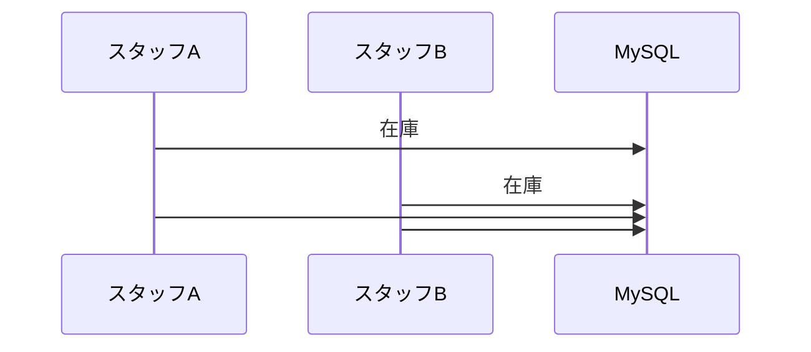

# 06. データアクセス設計

## 基本方針

**参照（Query）と更新（Server Action）を明確に分ける。**

| | 参照 | 更新 |
|---|---|---|
| 置き場所 | `features/<name>/queries.ts` | `features/<name>/actions.ts` |
| 呼び出し元 | Server Component から直接 `await` | フォーム送信 / ボタン |
| `'use server'` | 付けない | ファイル先頭に付ける |
| 戻り値 | データそのもの | フォームは Conform の `SubmissionResult`、成功時は原則 `redirect` |
| 認証確認 | layout で担保済み | **各関数で必須** |

参照系に `'use server'` を付けないのが重要。
付けると外部から呼べるエンドポイントになり、認証チェックが必要になる。
Server Component から直接呼ぶだけの関数は、ただの非同期関数でよい。

## ディレクトリ構成

```
src/features/
├── films/
│   ├── queries.ts       # locateFilms, fetchFilmDetail, ...
│   └── schema.ts        # 検索条件の Zod スキーマ
├── customers/
│   ├── queries.ts
│   ├── actions.ts       # 'use server'。認証・検証・トランザクション境界
│   ├── core.ts          # 実処理。テスト対象
│   └── schema.ts
├── rentals/
│   ├── queries.ts
│   ├── actions.ts
│   ├── core.ts
│   └── schema.ts
└── reports/
    └── queries.ts
```

機能単位でまとめると、画面を1つ作るときに触るファイルが1ディレクトリに収まる。

`actions.ts` と `core.ts` を分ける理由は [08-testing.md](./08-testing.md) を参照。
`'use server'` 付きのファイルは Vitest から直接扱いづらいため、
業務ロジックを素の関数として `core.ts` に置く。

## DB ハンドルの受け取り方

Query / core 関数は **DB ハンドルを引数で受け取る**。
テスト時にトランザクションを注入してロールバックできるようにするため。

```ts
// db/index.ts
export const db = drizzle(connection)
export type Database = typeof db
export type Transaction = Parameters<Parameters<typeof db.transaction>[0]>[0]
export type Executor = Database | Transaction
```

```ts
// 既定引数でグローバル db を使う。呼び出し側は省略できる
export async function locateFilms(params: FilmSearchParams, executor: Executor = db) {
  return executor.select({ ... }).from(film)
}
```

Server Component 側は第2引数を省略するだけなので、本番コードの書き味は変わらない。
この形を**最初から採用する**。後から全関数に引数を足すのは手戻りが大きい。

## 命名

プロジェクトの命名規約（`CLAUDE.md`）に従い、情報密度の低い動詞を避ける。

| 避ける | 使う | 理由 |
|---|---|---|
| `getFilms` | `locateFilms` / `fetchFilms` | 検索・取得の性質を示す |
| `getFilm` | `fetchFilmDetail` | I/O を伴うことが明確 |
| `saveCustomer` | `registerCustomer` / `updateCustomer` | 新規と更新を区別 |
| `doRental` | `createRental` | 何を作るかが分かる |
| `calc` | `computeOverdueFee` | 計算内容を示す |

単位を持つ値には名前に埋め込む。

```ts
rentalDurationDays    // not: duration
amountUsd             // not: amount（sakila は通貨単位が明示されていない）
daysOverdue           // not: overdue
```

## Query 一覧

### films

| 関数 | 引数 | 返り値 | 対応機能 |
|---|---|---|---|
| `locateFilms` | 検索条件 + ページ | 作品一覧 + 総件数 | F-03 |
| `fetchFilmDetail` | `filmId` | 基本情報 + 言語 | F-04 |
| `fetchFilmActors` | `filmId` | 俳優一覧 | F-04 |
| `fetchFilmCategories` | `filmId` | カテゴリ一覧 | F-04 |
| `fetchFilmStock` | `filmId` | 店舗別の在庫数 | F-04 |
| `listCategories` | — | カテゴリ全件（16件） | フィルタ用 |
| `listLanguages` | — | 言語全件（6件） | フィルタ用 |

### customers

| 関数 | 引数 | 返り値 | 対応機能 |
|---|---|---|---|
| `locateCustomers` | 検索条件 + ページ | 顧客一覧 + 総件数 | F-06 |
| `fetchCustomerDetail` | `customerId` | 基本情報 + 住所 | F-07 |
| `fetchActiveRentalsByCustomer` | `customerId` | 貸出中の一覧 | F-07 |
| `fetchRentalHistory` | `customerId` + ページ | 履歴 | F-07 |
| `fetchPaymentHistory` | `customerId` + ページ | 支払い履歴 | F-07 |
| `computeCustomerBalance` | `customerId`, 基準日 | 未払い残高 | F-07 |

`computeCustomerBalance` は `compute*` 接頭辞。
計算を伴う処理で、単純なアクセサではないことを示す。

### staff

| 関数 | 引数 | 返り値 | 対応機能 |
|---|---|---|---|
| `locateStaffByStore` | `storeId`, 検索条件 + ページ | スタッフ一覧 + 総件数 | F-17 |
| `fetchStaffProfile` | `staffId` | スタッフ + 住所 | F-17 |
| `fetchStoreManager` | `storeId` | 店長の `staffId` | F-17 |

店長判定には `fetchStoreManager` 相当のDB問い合わせを使う。JWT 内の値だけで判定すると、
店長移管後のセッションが古い権限を持ち続けるためである。

### rentals

| 関数 | 引数 | 返り値 | 対応機能 |
|---|---|---|---|
| `locateRentals` | フィルタ + ページ | レンタル一覧 | F-12 |
| `fetchOutstandingRentals` | フィルタ, 基準日 | 未返却一覧 + 延滞日数 | F-11 |
| `locateAvailableInventory` | `filmId`, `storeId` | 貸出可能な在庫 | F-09 |
| `countOutstanding` | — | 未返却件数 | F-02 |
| `countOverdue` | 基準日 | 延滞件数 | F-02 |

### reports

| 関数 | 引数 | 返り値 | 対応機能 |
|---|---|---|---|
| `computeMonthlySales` | `from`, `toExclusive` | 月次売上 | F-14 |
| `computeSalesByStore` | `from`, `toExclusive` | 店舗別売上 | F-14 |
| `computeSalesByStaff` | `from`, `toExclusive` | スタッフ別売上 | F-14 |
| `rankFilmsByRentalCount` | `from`, `toExclusive`, 件数 | 作品ランキング | F-15 |
| `rankCustomersBySpending` | `from`, `toExclusive`, 件数 | 顧客ランキング | F-16 |
| `fetchInventorySummary` | フィルタ | 在庫集計 | F-13 |

## Server Action 一覧

| Action | 入力 | トランザクション | 対応機能 |
|---|---|---|---|
| `registerCustomer` | 氏名, メール, 住所, 店舗 | **必要**（address + customer） | F-08 |
| `updateCustomer` | `customerId` + 変更内容 | **必要**（customer + address を同時に更新するため） | F-08 |
| `deactivateCustomer` | `customerId` | 不要 | F-08 |
| `reactivateCustomer` | `customerId` | 不要 | F-08 |
| `registerStaff` | 氏名, メール, 住所, 初期パスワード | **必要**（address + staff） | F-17 |
| `updateStaff` | `staffId` + 変更内容 | **必要**（staff + address を同時に更新するため） | F-17 |
| `deactivateStaff` | `staffId` | 店長移管時のみ必要 | F-17 |
| `reactivateStaff` | `staffId`, 一時パスワード | 不要 | F-17 |
| `resetStaffPassword` | `staffId`, 一時パスワード | 不要 | F-17 |
| `changeOwnPassword` | 現在 / 新パスワード | 不要 | F-17 |
| `createRental` | `customerId`, `filmId` | **必要**（rental + payment） | F-09 |
| `returnRental` | `rentalId` | 不要 | F-10 |

更新系は顧客・スタッフ管理を含めても少数で、参照が中心のアプリになる。

スタッフ管理 Action はすべて最初に `requireStoreManager()` を呼ぶ。このヘルパーは
セッションの `staffId` を取得し、DB 上の `store.manager_staff_id` と照合して、
対象スタッフが同じ店舗に所属することも確認する。 `changeOwnPassword` だけは本人の
Action なので店長権限を要求しない。

## Server Action の型

フォームから呼ぶ Action は `(previousState, formData)` の形に揃え、React 19 の
`useActionState` へ直接渡す。検証エラーは独自の成功/失敗型に詰め替えず、
Conform の `submission.reply()` が返す `SubmissionResult` をそのまま返す。

```ts
import type { SubmissionResult } from '@conform-to/react'

type FormAction = (
  previousState: unknown,
  formData: FormData,
) => Promise<SubmissionResult | undefined>
```

`parseWithZod` の結果には入力値、フィールドエラー、フォーム全体エラー、
再送信に必要なメタデータが含まれる。フォーム側はこれを `useForm({ lastResult })` に
渡せばよく、Zod エラーから独自形式への変換は不要になる。

競合や業務ルール違反のような予期した失敗も `submission.reply()` で返す。

```ts
return submission.reply({
  formErrors: ['選択した作品は直前に貸し出されました。別の作品を選んでください。'],
})
```

成功後に別画面へ進むフォームは `redirect()` する。同じ画面に留まるフォームだけ、
成功メッセージを含む Action state を別途定義する。フォームを使わない単純な操作は
無理に `SubmissionResult` へ合わせず、`void` または操作専用の最小限の型を使う。

想定外のエラー（DB接続断など）は例外のままにして、
Next.js の `error.tsx` に任せる。**予期したエラーは戻り値、予期しないエラーは例外**。

## Server Action の骨格

すべての Action が同じ4段構えになる。

```ts
// rentals/actions.ts
'use server'

import { parseWithZod } from '@conform-to/zod'
import { revalidatePath } from 'next/cache'
import { redirect } from 'next/navigation'

export async function createRental(_previousState: unknown, formData: FormData) {
  // 1. 認証
  const session = await requireSession()

  // 2. 検証
  const submission = parseWithZod(formData, { schema: createRentalSchema })
  if (submission.status !== 'success') {
    return submission.reply()
  }

  // 3. 実行（トランザクション境界だけここで張り、中身は core に委譲）
  let rentalId: number
  try {
    rentalId = await db.transaction((tx) =>
      performRental(tx, submission.value, session.user.staffId),
    )
  } catch (error) {
    if (error instanceof InventoryUnavailableError) {
      return submission.reply({
        formErrors: ['選択した作品に貸出可能な在庫がありません。'],
      })
    }
    throw error
  }

  // 4. キャッシュ無効化
  revalidatePath(`/customers/${submission.value.customerId}`)
  revalidatePath('/rentals')
  revalidatePath('/inventory')

  // 5. 成功時の遷移。redirect は例外を投げるため最後に呼ぶ
  redirect(`/customers/${submission.value.customerId}?rentalId=${rentalId}`)
}
```

業務ロジックは `core.ts` 側に置く。

```ts
// rentals/core.ts — 'use server' を付けない
export async function performRental(
  tx: Executor,
  input: CreateRentalInput,
  staffId: number,
): Promise<number> {
  // active な顧客を確認 → 在庫をロックして確定 → rental INSERT → payment INSERT
}
```

Action は「認証・検証・トランザクション境界・キャッシュ無効化」という
定型処理だけを担い、`core.ts` がテスト対象になる。

### 1. 認証

[05-auth.md](./05-auth.md) のとおり、Action は独立したエンドポイントとして
直接呼べるため、画面が保護されていても各 Action で検証する。

`requireSession()` のようなヘルパーを1つ作り、
セッションがなければ例外を投げる形にしておく。

### 2. 検証

Action が受け取る `FormData` は信頼せず、必ず `parseWithZod` を通してから使う。
`submission.status === 'success'` の分岐後だけ `submission.value` を core 関数へ渡す。
TypeScript の型注釈だけでは実行時検証にならない。

### 4. キャッシュ無効化

Next.js はデータをキャッシュするため、更新後に `revalidatePath` を呼ばないと
画面に反映されない。どのパスを無効化すべきかは Action ごとに異なる。

| Action | 無効化するパス |
|---|---|
| `createRental` | `/customers/[id]`, `/rentals`, `/`, `/inventory` |
| `returnRental` | `/rentals/outstanding`, `/customers/[id]`, `/` |
| `registerCustomer` | `/customers` |

## トランザクションが必要な処理

### createRental（F-09）

`rental` と `payment` は必ず対で作られる必要がある。
片方だけ残ると、貸出記録はあるのに支払い記録がない（またはその逆）状態になる。

```ts
await db.transaction(async (tx) => {
  // 1. 顧客が active であることを確認
  // 2. 在庫をロックして確定
  // 3. rental を INSERT
  // 4. payment を INSERT（rental_id を紐付け）
})
```

#### 在庫の競合制御

在庫を選んでから INSERT するまでの間に、
別のスタッフが同じDVDを貸し出す可能性がある。



トランザクション内で `SELECT ... FOR UPDATE` を使い、
在庫行をロックしながら未返却レコードのない候補を確定する。
候補検索をトランザクションの外で済ませてからロックする形にはしない。

```sql
SELECT i.inventory_id
FROM inventory i
LEFT JOIN rental r
       ON i.inventory_id = r.inventory_id
      AND r.return_date IS NULL
WHERE i.film_id = ? AND i.store_id = ? AND r.rental_id IS NULL
LIMIT 1
FOR UPDATE;
```

Drizzle では `.for('update')` で表現できる。

`rental` に未返却を一意にする制約はない。このロック取得を `performRental` に
閉じ込め、ほかの経路で直接 `rental` を INSERT しないことが二重貸出を防ぐ条件になる。

実際にはスタッフ2名で競合は起きないが、
**なぜロックが必要か**を理解する題材として意味がある。
書籍のトランザクションの章と対応させると理解しやすい。

### registerCustomer（F-08）

`address` を先に INSERT し、得られた `address_id` で `customer` を INSERT する。
途中で失敗すると住所だけが残るため、トランザクションで囲む。

```ts
await db.transaction(async (tx) => {
  const [{ insertId }] = await tx.insert(address).values({ ... })
  await tx.insert(customer).values({ addressId: insertId, ... })
})
```

MySQL では `INSERT` の戻り値から `insertId` を取る。
PostgreSQL の `RETURNING` とは書き方が異なる点に注意。

### returnRental（F-10）

単一テーブルの `UPDATE` なのでトランザクションは不要。
ただし条件に `return_date IS NULL` を含めて、二重返却を防ぐ。

```ts
const result = await db.update(rental)
  .set({ returnDate: appNow() })
  .where(and(eq(rental.rentalId, rentalId), isNull(rental.returnDate)))

// 更新件数が 0 なら「既に返却済み」
```

更新件数を見て判定する形にすると、
先に SELECT して確認するより競合に強い（確認と更新の間に他者が割り込めない）。

## Zod スキーマ

### drizzle-zod の使いどころ

Drizzle スキーマから Zod スキーマを生成できる。

```ts
import { createInsertSchema } from 'drizzle-zod'
const baseCustomerSchema = createInsertSchema(customer)
```

ただし生成されるのは**テーブル構造そのまま**のスキーマで、
フォームの入力形とは一致しないことが多い。

| 用途 | 方針 |
|---|---|
| フォーム入力 | 手書き。画面に出す項目だけを定義する |
| DB 挿入直前 | `createInsertSchema` を使うと列の取りこぼしを防げる |

`customer` の INSERT を例にすると、フォームからは
`first_name`, `last_name`, `email`, 住所 を受け取るが、
`create_date` や `store_id` はサーバー側で決める。
生成スキーマをそのままフォームに使うと、これらも入力必須になってしまう。

**入力用スキーマは手書き、DB層の検証に生成スキーマ**という分担が実用的。

### 検索条件のスキーマ

URL クエリパラメータは常に文字列なので、数値への変換を含める。

```ts
export const filmSearchSchema = z.object({
  q: z.string().trim().optional(),
  category: z.coerce.number().int().positive().optional(),
  rating: z.enum(['G', 'PG', 'PG-13', 'R', 'NC-17']).optional(),
  sort: z.enum(['title', 'releaseYear', 'rentalRate', 'length']).default('title'),
  page: z.coerce.number().int().min(1).default(1),
})
```

`z.coerce.number()` が文字列 → 数値の変換を担う。
`searchParams` をそのまま `parse` に渡せる形にしておくと、
Server Component 側が簡潔になる。

不正な値が来た場合は既定値にフォールバックする（`safeParse` して失敗なら既定値）。
URL は手で編集されうるため、エラー画面を出すより既定値に倒すほうが自然。

## ページネーション

一覧画面では**件数取得と明細取得の2クエリ**が必要になる。

```ts
const [rows, [{ total }]] = await Promise.all([
  db.select({ ... }).from(film).where(conditions).limit(perPage).offset(offset),
  db.select({ total: count() }).from(film).where(conditions),
])
```

`Promise.all` で並列に投げる。同じ `conditions` を両方で使うため、
条件の組み立てを関数に切り出しておくと重複しない。

### OFFSET の限界を体感する

`rental` は 16,044件。`OFFSET 15000` のような深いページでは
MySQL が読み飛ばす行を全て走査するため遅くなる。

学習として、以下を試すと違いが分かる。

| 方式 | 特徴 |
|---|---|
| `LIMIT ... OFFSET` | 実装が簡単。深いページで劣化 |
| カーソルベース（`WHERE id < ?`） | 高速だが「N ページ目へ飛ぶ」ができない |

最初は OFFSET で作り、遅さを確認してからカーソル方式を試す順序を勧める。

## N+1 を避ける

一覧に関連データを添える場合、行ごとにクエリを投げると件数分の往復が発生する。

```ts
// 悪い例: 20件の作品それぞれに俳優を問い合わせる
for (const film of films) {
  film.actors = await fetchFilmActors(film.filmId)  // 20回
}
```

表示中の ID をまとめて1クエリで取り、アプリ側で対応付ける。

```ts
// 良い例: 1回で済ませる
const filmIds = films.map((f) => f.filmId)
const actors = await db.select().from(filmActor)
  .where(inArray(filmActor.filmId, filmIds))
```

`film_actor` は 5,462件あるため、`inArray` で必要な分だけ絞る。
JOIN して1クエリにする方法もあるが、多対多を JOIN すると行が重複するため、
別クエリ + アプリ側での対応付けのほうが扱いやすい場面が多い。

## 生SQLを使う場面

Drizzle のクエリビルダーで表現できない機能は `sql` テンプレートで書く。

| 場面 | 理由 |
|---|---|
| FULLTEXT 検索（`MATCH ... AGAINST`） | 専用 API がない |
| `DATE_ADD` / `DATEDIFF` | MySQL 固有の日付関数 |
| `DATE_FORMAT` による年月の丸め | 同上 |

```ts
sql`MATCH(${filmText.title}, ${filmText.description}) AGAINST (${keyword} IN BOOLEAN MODE)`
```

テンプレートリテラルの `${}` はプレースホルダとして展開されるため、
文字列結合と違い SQL インジェクションにはならない。
ただし `sql.raw()` は**エスケープされない**ので、ユーザー入力には絶対に使わない。

## 日付の扱い

[04-features.md](./04-features.md) F-02 のとおり、データが 2005〜2006年のため
基準時刻を固定する。

```ts
// lib/app-date.ts
export function appNow(): Date {
  const override = process.env.APP_TODAY
  return override ? new Date(override) : new Date()
}
```

`new Date()` を直接書かず、必ずこの関数を経由する。
集計・延滞判定・レンタル登録日のすべてが同じ基準で動く。
`APP_TODAY` には `2006-02-14T00:00:00Z` のような UTC の ISO 8601 時刻を入れる。
`YYYY-MM-DD` だけの値はタイムゾーンの解釈が曖昧になるため使わない。

実データに切り替えるときは環境変数を外すだけで済む。

### 基準日は引数で渡す

`appNow()` を関数の内部で直接呼ぶと、テストで時刻を制御するのに
`vi.setSystemTime` が必要になる。**基準日は引数で受け取る**形にしておく。

```ts
// ✕ 内部で暗黙に現在時刻を使う
export async function countOverdue(executor: Executor = db) {
  const base = appNow()
}

// ○ 引数で受ける。呼び出し側が appNow() を渡す
export async function countOverdue(baseDate: Date, executor: Executor = db) { }
```

延滞判定・売上集計・残高計算のすべてが対象。詳細は [08-testing.md](./08-testing.md) を参照。
