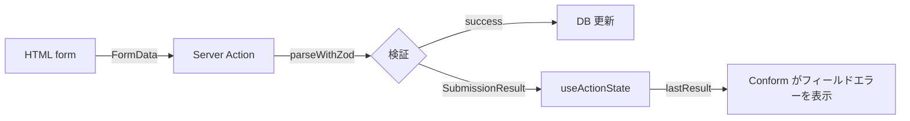
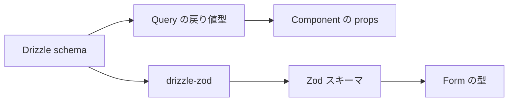

# 07. コンポーネント設計

## Server / Client の切り分け

App Router では**既定が Server Component**。`'use client'` を付けたところから
クライアント側になり、そこから下は全て巻き込まれる。

| Server Component のまま | Client Component にする |
|---|---|
| データ取得を伴う画面・一覧・詳細 | Conform の `useForm` を使うフォームの葉 |
| テーブル、カード、バッジなどの表示 | 開閉するダイアログ・ドロップダウン |
| ページネーションのリンク | 入力に即応する検索ボックス |
| レイアウト、ナビゲーション | グラフ（描画ライブラリがDOM APIを使う） |

### 境界を下げる

`'use client'` は**必要な葉に近い位置**に置く。

```
❌ page.tsx に 'use client'
   → ページ全体がクライアント化し、データ取得を別途 API 経由にする羽目になる

✅ page.tsx は Server Component のまま
   └── <FilmTable />          Server（データを props で受ける）
   └── <FilmSearchBox />      Client（入力を扱う）
```

検索ボックスだけを Client にすれば、一覧本体は Server のままで済む。

### URL に状態を置けば Client を減らせる

[03-screens.md](./03-screens.md) の方針どおり、検索条件やページ番号を
URL クエリパラメータに持たせる。

```
/films?q=dinosaur&category=1&page=2
```

こうすると一覧・フィルタ・ページングのすべてが
`searchParams` を読む Server Component で完結する。
`useState` でフィルタを持つと、連鎖的に Client 化が広がる。

## コンポーネント階層

```
src/components/
├── ui/                    # shadcn/ui の生成物（直接編集しない）
│   ├── button.tsx
│   ├── table.tsx
│   ├── dialog.tsx
│   └── ...
├── layout/
│   ├── app-header.tsx     # ログイン中スタッフ名、ログアウト
│   └── app-sidebar.tsx    # ナビゲーション
├── shared/                # 機能横断の再利用部品
│   ├── data-table.tsx
│   ├── pagination.tsx
│   ├── search-box.tsx
│   ├── empty-state.tsx
│   ├── stat-card.tsx
│   ├── money.tsx
│   └── date-display.tsx
└── features/              # 機能固有
    ├── films/
    │   ├── film-table.tsx
    │   ├── film-filters.tsx
    │   └── film-stock-badge.tsx
    ├── customers/
    ├── rentals/
    └── reports/
```

`ui/` は shadcn が生成したファイル。カスタマイズしたくなったら直接編集してよいが、
再生成すると上書きされるため、独自の振る舞いは `shared/` 側に置く。

## 導入する shadcn/ui コンポーネント

| コンポーネント | 用途 |
|---|---|
| `button` | 全般 |
| `input` / `label` | フォーム |
| `table` | 一覧表示 |
| `card` | ダッシュボードの指標、詳細のセクション |
| `badge` | カテゴリ、レーティング、在庫状態 |
| `select` | カテゴリ・店舗の選択 |
| `dialog` | 返却確認、削除確認 |
| `alert` | エラー表示 |
| `skeleton` | ローディング |
| `command` | 顧客・作品の検索付きセレクト |
| `pagination` | ページネーション |
| `tabs` | 顧客詳細のセクション切り替え |

`command` は600件の都市や599件の顧客から選ぶ場面で効く。
通常の `select` では実用に耐えない。

## 共通コンポーネント

### `data-table.tsx`

一覧画面が7つあるため、テーブルの見た目を揃える土台を1つ作る。

```
props:
  columns   列定義（ヘッダー名、セルの描画方法、寄せ方向）
  rows      表示データ
  emptyText 0件時の文言
```

TanStack Table を入れる選択肢もあるが、
**最初は素の `<table>` で十分**。ソートとページングは URL で処理し、
クライアント側の状態を持たないため、テーブルライブラリの利点が薄い。

### `pagination.tsx`

現在のページ、総ページ数、リンク生成を受け取る。
リンクは `<Link>` で作り、既存のクエリパラメータを保持したまま `page` だけ差し替える。

```
/films?q=dino&category=1&page=2  →  page だけ 3 に変える
```

`URLSearchParams` を複製して `set('page', n)` する形にすると、
フィルタ条件を落とさずに済む。

### `money.tsx`

`DECIMAL` は Drizzle から**文字列**で返る（[02-er-diagram.md](./02-er-diagram.md) 参照）。
表示時のフォーマットを1箇所に集約する。

```
props: amount（string | number）
出力:  $4.99
```

sakila の金額に通貨単位の定義はないが、データが米国の店舗を想定しているため
`$` 表記で統一する。判断を1ファイルに閉じ込めておけば後から変えられる。

### `date-display.tsx`

`DATETIME` の表示形式を揃える。
データが2005〜2006年のため「3日前」のような相対表記は使わない
（すべて「20年前」になり意味をなさない）。絶対日付で表示する。

### `stat-card.tsx`

ダッシュボードの指標カード。数値、ラベル、遷移先を受け取る。

### `empty-state.tsx`

検索結果0件、履歴なしなど。一覧が7画面あるため共通化する価値がある。

## フォームの実装パターン

フォームはログイン、パスワード変更、顧客・スタッフの登録編集、レンタル受付に使う。
**Conform + Zod + Server Action** を組み合わせ、HTML の `<form>` と `FormData` を
データの境界にする。ページと初期データ取得は Server Component のまま保ち、
`useForm` と `useActionState` が必要なフォーム本体だけを小さな Client Component にする。



### Server Action を正とする

検証の正本は Server Action に置く。Action は `FormData` を直接受け取り、
`parseWithZod` で検証する。JavaScript が読み込まれる前でもネイティブフォームとして
送信でき、Action が返した `SubmissionResult` を Conform が同じフィールドへ戻す。

Zod スキーマは `features/<name>/schema.ts` に置く。まずサーバー検証だけで実装し、
入力中の即時検証が本当に必要なフォームだけ、同じスキーマを Client Component の
`onValidate` からも使う。クライアント検証を加えても、Action 側の再検証は省略しない。

```ts
// features/customers/actions.ts
'use server'

import { parseWithZod } from '@conform-to/zod'

export async function registerCustomer(
  _previousState: unknown,
  formData: FormData,
) {
  await requireSession()

  const submission = parseWithZod(formData, { schema: customerSchema })
  if (submission.status !== 'success') {
    return submission.reply()
  }

  await db.transaction((tx) => registerCustomerCore(tx, submission.value))
  revalidatePath('/customers')
  redirect('/customers')
}
```

認証・認可は検証より先に行う。`FormData` の hidden 値も信用せず、`staffId` や
`storeId` はセッションと DB から決める。

### Action の結果をフォームに戻す

フォーム本体では React 19 の `useActionState` と Conform の `useForm` を接続する。
`lastResult` を渡すだけで、Action のフィールドエラーとフォーム全体エラーを
Conform のメタデータから描画できる。フィールドごとのエラーを手作業で変換しない。

```tsx
'use client'

import { getFormProps, getInputProps, useForm } from '@conform-to/react'
import { useActionState } from 'react'

export function CustomerForm() {
  const [lastResult, action, pending] = useActionState(registerCustomer, undefined)
  const [form, fields] = useForm({
    lastResult,
  })

  return (
    <form {...getFormProps(form)} action={action}>
      <Label htmlFor={fields.firstName.id}>名</Label>
      <Input {...getInputProps(fields.firstName, { type: 'text' })} />
      <p id={fields.firstName.errorId}>{fields.firstName.errors}</p>

      <p id={form.errorId}>{form.errors}</p>
      <Button type="submit" disabled={pending}>登録</Button>
    </form>
  )
}
```

入力値は Conform の内部状態へコピーせず、名前付きのネイティブ input に保持する。
初期値は `useForm({ defaultValue })` に渡す。サーバーから渡す初期データは
シリアライズ可能な値に絞り、`Date` や `DECIMAL` は文字列へ変換してから渡す。

この基本形では送信時にサーバーで検証する。入力中にも検証したい場合だけ、
`useForm` の `onValidate` で同じスキーマを `parseWithZod` に渡し、
`shouldValidate: 'onBlur'` と `shouldRevalidate: 'onInput'` を追加する。

### shadcn/ui との接続

特定のフォームライブラリを前提にした shadcn/ui `Form` ラッパーは使わない。
`Input`、`Label`、`Select`、`Button` などの見た目の部品へ、Conform の
`getInputProps` / `getSelectProps` と `id`、`aria-describedby` を渡す。
共通化する場合も Conform の field metadata を受け取る薄い `FormField` に留め、
スキーマや送信処理を UI コンポーネントへ隠さない。

### 送信中の状態

`useActionState` の `pending`、または form の内側に分離した送信ボタンで
`useFormStatus` の `pending` を使い、ボタンを無効化する。レンタル受付の二重送信は
[06-data-access.md](./06-data-access.md) のとおり DB 側でも防ぐが、
UI でも止めておく。

### JavaScript なしでも成立させる

Conform は progressive enhancement を前提にする。成功時の `redirect`、サーバー検証、
DB 更新はすべて Action 内で完結させる。ダイアログ、検索候補、入力中の再検証は
JavaScript があるときの改善であり、送信そのものの前提にはしない。

## ローディングとエラー

App Router の規約ファイルを使う。

```
app/(dashboard)/films/
├── page.tsx
├── loading.tsx     # Suspense フォールバック
└── error.tsx       # エラー境界（'use client' 必須）
```

| ファイル | 役割 |
|---|---|
| `loading.tsx` | `skeleton` でテーブルの形を出す |
| `error.tsx` | 予期しない例外の受け皿。再試行ボタンを置く |
| `not-found.tsx` | 存在しない `filmId` などで `notFound()` を呼んだとき |

詳細画面で ID が見つからない場合は `notFound()` を呼ぶ。
404 を自前でハンドリングする必要がなくなる。

### 部分的な Suspense

作品詳細は4つのクエリ（基本情報・俳優・カテゴリ・在庫）を投げる。
すべて待つと表示が遅れるため、`<Suspense>` で区切ると
基本情報を先に出せる。

ただし最初は全部 `await` して構わない。
遅さを感じてから分割するほうが、Suspense の効果を理解しやすい。

## 型の流れ

Drizzle スキーマから UI まで型が繋がる構造にする。



Query の戻り値に明示的な型注釈を付けず、
Drizzle の推論に任せると、列を足したときに props まで自動で伝播する。

```ts
// 戻り値型を書かない → 推論に任せる
export async function locateFilms(params: FilmSearchParams) {
  return db.select({ ... }).from(film)
}

// コンポーネント側で Awaited<ReturnType<>> を使う
type FilmRow = Awaited<ReturnType<typeof locateFilms>>[number]
```

この形にしておくと、SELECT する列を変えたときに
使う側の型エラーで気づける。型を手書きすると二重管理になり、ずれる。

## Biome の設定

| 項目 | 方針 |
|---|---|
| フォーマット | Biome に任せる（Prettier は入れない） |
| インポート順 | Biome の `organizeImports` を有効化 |
| 保存時実行 | `.vscode/settings.json` で formatOnSave |

既に `.vscode/` があるため、リポジトリ直下の設定を追記する形になる。

shadcn/ui の生成コードは Biome の一部ルールに引っかかることがある。
`ui/` ディレクトリを lint の対象外にするか、該当ルールを緩める。

## 実装の順序

コンポーネントは画面と一緒に作るが、以下だけ先に用意すると後が楽になる。

| 順 | 作るもの | 理由 |
|---|---|---|
| 1 | `layout/` のヘッダー・サイドバー | 全画面の土台 |
| 2 | `shared/data-table.tsx` | 一覧が7画面あり最初に効く |
| 3 | `shared/pagination.tsx` | 同上 |
| 4 | `shared/money.tsx` / `date-display.tsx` | 表示形式のばらつきを最初から防ぐ |
| 5 | `shared/empty-state.tsx` | 0件表示の使い回し |

残りは必要になった時点で作る。
「3箇所で同じものを書いたら共通化する」くらいの基準でよく、
先回りして抽象化すると使われない部品が増える。
