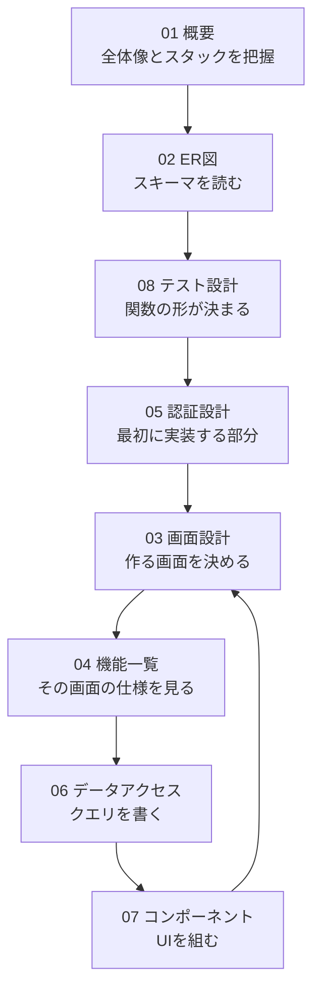

# sakila 管理システム 設計ドキュメント

`db/init` の sakila サンプルデータベースを題材に、
**DVDレンタル店のスタッフ向け管理システム**を実装するための設計資料。

書籍「初めてのSQL」で学んだ内容を、実際に動くアプリケーションに接続することが目的。
実装は手作業で行う前提のため、各ドキュメントは完成コードではなく
**クエリの構造・設計判断・つまずきどころ**を記述している。

## ドキュメント

| # | ドキュメント | 内容 |
| --- | --- | --- |
| 01 | [概要](./01-overview.md) | 目的、技術スタック、ディレクトリ構成、データの前提 |
| 02 | [ER図・テーブル定義](./02-er-diagram.md) | 16テーブルの構造、Drizzle 型対応表 |
| 03 | [画面設計](./03-screens.md) | 21画面のルーティングと画面遷移 |
| 04 | [機能一覧](./04-features.md) | 17機能の仕様、使用テーブル、SQLの要点 |
| 05 | [認証設計](./05-auth.md) | Auth.js + `staff` テーブル、bcrypt 移行 |
| 06 | [データアクセス設計](./06-data-access.md) | Query / Server Action、トランザクション |
| 07 | [コンポーネント設計](./07-components.md) | Server/Client の切り分け、共通部品 |
| 08 | [テスト設計](./08-testing.md) | Vitest、実DB接続、トランザクションロールバック |
| 09 | [開発環境セットアップ](./09-dev-setup.md) | Volta、docker compose、環境変数 |

## 技術スタック

Next.js（App Router）/ TypeScript / Drizzle ORM / drizzle-zod / Zod /
React Hook Form / shadcn/ui / Biome / Auth.js v5 / MySQL 8.0 / Vitest

選定理由と不採用にしたもの（Hono、Better Auth、Cognito）は
[01-overview.md](./01-overview.md) に記載。

## 読む順序

初めて読む場合は番号順が自然だが、実装に着手する際は以下の順で参照する。



画面を1つ作るたびに 03 → 04 → 06 → 07 を巡回する形になる。

**08 を先に読む理由:** テスト可能にするために
Query 関数が DB ハンドルを引数で受け取る形（`Executor` の注入）と、
Server Action からコアロジックを分離する形が必要になる。
後から直すと手戻りが大きいため、実装前に把握しておく。

## 実装の段階

前段の成果が次段で必ず使われる順序になっている。

| 段階 | 内容 | 得られるもの | 参照 |
| --- | --- | --- | --- |
| 0 | 開発環境セットアップ | 動く土台 | [09](./09-dev-setup.md) |
| 1 | プロジェクト初期化・Drizzle 接続 | DB に繋がる | [01](./01-overview.md) |
| 2 | スキーマ定義（中核テーブルは手書き） | 型付きのテーブル定義 | [02](./02-er-diagram.md) |
| 3 | Vitest 導入・テスト用DB | 以降の実装を検証できる | [08](./08-testing.md) |
| 4 | 認証（ログイン／ログアウト） | 以降の画面を保護できる | [05](./05-auth.md) |
| 5 | 作品一覧・詳細 | 一覧・詳細・JOIN の型 | [03](./03-screens.md) [04](./04-features.md) |
| 6 | 顧客一覧・詳細 | 同じパターンの反復で定着 | 同上 |
| 7 | レンタル受付・返却 | トランザクション | [06](./06-data-access.md) |
| 8 | 売上レポート | 集計クエリ | [04](./04-features.md) |

段階4までで「DBに繋がり、テストが書け、ログインでき、型が通る」土台ができる。

テスト環境を段階3に置いたのは、
JOIN の経路が正しいかを目視で確認するのは現実的でないため。
`rental → inventory → film` のような多段 JOIN は、
実データに対する検証がないと誤りに気づけない。

## 環境構成

**DB は Docker、Next.js はネイティブの Node。**
macOS では Docker のバインドマウント越しのファイル監視で HMR が遅くなるため、
アプリはコンテナに入れない。バージョンの固定は Volta で行う。

```
docker compose up -d      # MySQL（開発用 3306 / テスト用 3307）
pnpm dev                   # Next.js
```

接続確認。

```bash
docker compose exec mysql mysql -uroot -psakila sakila -e "SELECT COUNT(*) FROM film;"
```

`1000` が返れば DB は正常。
手順の詳細は [09-dev-setup.md](./09-dev-setup.md) を参照。

## 設計上の注意点（先に知っておくべき3点）

### 1. データが 2005〜2006 年で止まっている

```
rental / payment の期間: 2005-05-24 〜 2006-02-14
```

`NOW()` を使うと全レンタルが延滞扱いになり、当月売上は常にゼロになる。
基準日を環境変数で固定する方針を [04-features.md](./04-features.md) F-02 に記載。

### 2. `film` と `inventory` は別物

| | 意味 |
| --- | --- |
| `film` | 作品（カタログ上の1件）— 1,000件 |
| `inventory` | 物理的なDVD1枚 — 4,581件 |

「作品が借りられるか」は `film` ではなく `inventory` を見る。
さらに在庫の有無は `inventory` の存在ではなく
**未返却 `rental` の不在**で決まる。このスキーマの最も重要な構造。

### 3. `staff.password` はそのまま使えない

SHA1 ハッシュ（1件は NULL）で、カラム長も 40文字しかない。
bcrypt への移行手順を [05-auth.md](./05-auth.md) に記載。

## 関連

| パス | 内容 |
| --- | --- |
| `db/init/01-sakila-schema.sql` | スキーマ定義（本ドキュメントの出典） |
| `db/init/02-sakila-data.sql` | 投入済みデータ |
| `compose.yml` | MySQL 8.0 の起動設定 |
| `docs/` | 書籍「初めてのSQL」の章まとめ |
